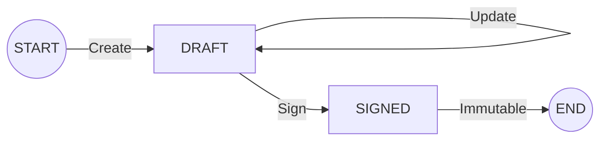

# DESIGN-ONLY: Clinical Note Write Constraints - Golden Path Flow

## 1. CLASSIFICATION
- **Document Type**: DESIGN-ONLY
- **Governance Level**: GOLDEN PATH SPECIFICATION
- **Scope**: SUCCESS PATH ONLY (Create → Update → Sign)
- **Status**: DRAFT / PROPOSED

## 2. PURPOSE
This document defines the single, deterministic success path for clinical note write operations within the Zenthea Platform. It maps the transition of a clinical note from non-existence to its final, immutable `SIGNED` state.

## 3. ACTORS AND BOUNDARIES
Operations are governed by capability-based authorization at the system boundary.

| Actor Capability | Boundary Responsibility |
| :--- | :--- |
| **Clinical Author** | The only actor capable of initiating and mutating a clinical note. |
| **System Boundary** | Enforces identity, tenant isolation, and capability verification. |
| **Persistence Boundary** | Commits state transitions and emits audit evidence. |

## 4. DETERMINISTIC WRITE SEQUENCE
The following sequence represents the only permitted path to a `SIGNED` note.

### 4.1. Step 1: Create (`DRAFT`)
1. **Request**: Clinical Author initiates a `Create` request.
2. **Tenant Isolation Checkpoint**: System verifies the Author and the target context belong to the same Tenant.
3. **Capability Verification**: System confirms the Actor possesses the `Clinical Author` capability.
4. **State Initialization**: Note is initialized in the `DRAFT` state.
5. **Ownership Assignment**: The Actor is permanently recorded as the `Author`.
6. **Audit Emission**: `NOTE_CREATED` event is emitted (Metadata-only).

### 4.2. Step 2: Update (0..N) (`DRAFT` → `DRAFT`)
1. **Request**: Clinical Author initiates an `Update` request.
2. **Tenant Isolation Checkpoint**: System verifies the Author and the Note belong to the same Tenant.
3. **Author-Only Enforcement**: System verifies the Actor is the original `Author`.
4. **State Validation**: System confirms the Note is in the `DRAFT` state.
5. **Persistence**: Content is updated; state remains `DRAFT`.
6. **Audit Emission**: `NOTE_UPDATED` event is emitted (Metadata-only).

### 4.3. Step 3: Sign (`DRAFT` → `SIGNED`)
1. **Request**: Clinical Author initiates a `Sign` request.
2. **Tenant Isolation Checkpoint**: System verifies the Author and the Note belong to the same Tenant.
3. **Author-Only Enforcement**: System verifies the Actor is the original `Author`.
4. **State Validation**: System confirms the Note is in the `DRAFT` state.
5. **Terminal Transition**: Note state is updated to `SIGNED`.
6. **Immutability Lock**: Persistence boundary prevents any further mutations.
7. **Audit Emission**: `NOTE_SIGNED` event is emitted (Metadata-only).

## 5. STATE TRANSITION GRAPH
Success path transitions are unidirectional and terminal.

## 6. DETERMINISM GUARANTEES
- **No Branching**: There are no alternative paths or conditional logic branches in the success flow.
- **No Retries**: The flow assumes a single, successful execution of each step.
- **No Background Work**: All operations are synchronous and completed within the request-response cycle.
- **No Reads**: This flow is strictly concerned with state-changing operations.

## 7. AUDIT EMISSION RULES
- **Success-Only**: Audit events are emitted only upon successful completion of the persistence operation.
- **Metadata-Only**: Audit payloads contain Actor ID, Tenant ID, Resource ID, and Timestamp. No clinical content is included.
- **Deterministic Frequency**: Exactly one audit event per successful write operation.
